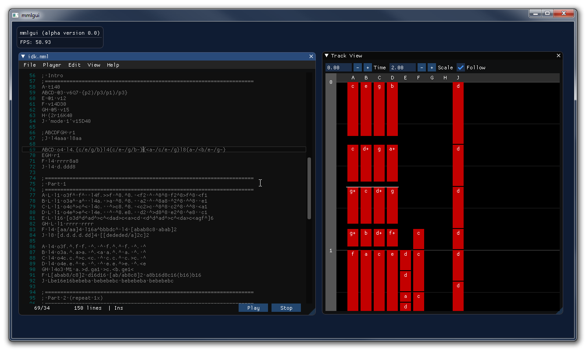

mmlgui
======

MML (Music Macro Language) editor and compiler GUI. Powered by the [ctrmml](https://github.com/superctr/ctrmml) framework.

## Features

- MML text editor with instant feedback
- Supports Sega Mega Drive sound chips (YM2612, SN76489)
- Visualization of MML tracks
- Highlights currently playing notes in the editor window

### Future features / TODO

- Configuration window
- Export to MDSDRV (Sound driver for Sega Mega Drive)
- Support more sound chips
- More track visualizations

## Using

See [ctrmml/mml_ref.md](ctrmml/mml_ref.md) for an MML reference.

## Compiling

### Prerequisites
First, make sure all submodules have been cloned. If you didn't clone this repository
with `git clone --recurse-submodules`, do this:

	git submodule update --init

Make sure you have the following packages installed: (this list might not be 100% correct)

	glfw  libvgm

#### Installing libvgm

If libvgm is not available on your system, you need to install it manually. Example:

##### Linux

	mkdir build && cd build
	cmake ..
	make
	sudo make install

##### Windows (MSYS2)
The `CMAKE_INSTALL_PREFIX` should of course match where your MSYS2/MinGW install folder is.

	mkdir build && cd build
	cmake .. -G "MSYS Makefiles" -D AUDIODRV_LIBAO=OFF -D CMAKE_INSTALL_PREFIX=/mingw64
	make
	make install

### Building
Once all prerequisites are installed, it should be as easy as

	make

To build a release binary, add `RELEASE=1`.

### Special thanks

- [libvgm](https://github.com/ValleyBell/libvgm)
- [glfw](https://www.glfw.org/)
- [Dear ImGui](https://github.com/ocornut/imgui)
- [Dear ImGui addons branch](https://github.com/Flix01/imgui)
- [ImGuiColorTextEditor](https://github.com/BalazsJako/ImGuiColorTextEdit)

### Copyright

&copy; 2020 Ian Karlsson

	This program is free software; you can redistribute it and/or modify
	it under the terms of the GNU General Public License as published by
	the Free Software Foundation; either version 2 of the License, or
	(at your option) any later version.

	This program is distributed in the hope that it will be useful,
	but WITHOUT ANY WARRANTY; without even the implied warranty of
	MERCHANTABILITY or FITNESS FOR A PARTICULAR PURPOSE.  See the
	GNU General Public License for more details.

	You should have received a copy of the GNU General Public License along
	with this program; if not, write to the Free Software Foundation, Inc.,
	51 Franklin Street, Fifth Floor, Boston, MA 02110-1301 USA.
